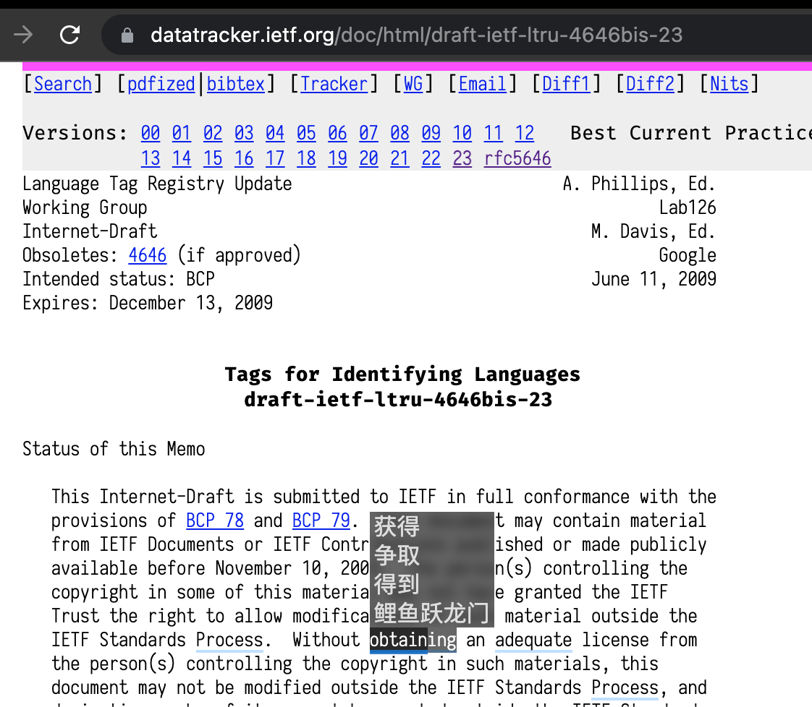

# EnglishFlow

## 解决什么问题

1. 我需要经常 StackOverflow, 英文文章, 英文文档, 但其中有不少英语单词我不知道什么意思
2. 英文社区也有很多有趣的东西(比如 reddit.ProgrammerHumor)
3. 我希望能逐渐提升自己的英语水平

但是

1. 我经常忘记英语单词的意思
2. 我经常不确定自己对一个单词的理解是正确
3. 当前各种查单词的应用/网页对于我来说都有些繁琐, 心智负担较大
4. 全文翻译, 需要频繁对比中文段落与英文段落, 心智负担较大
5. 下述应用不能完全满足需求
   - Google Translate
   - DeepL
   - Youdao
   - Google Search: 'define FooBar'
   - Google Search: 'pronounce FooBar'

所以我希望有一种功能:

1. 不破坏当前英文的上下文
   - 不离开当前网页, 有时候使用某些工具全文翻译还不如不翻译, 很多上下文都丢失了
2. 快速获取中文释义
   - 最快的方式当然是眼球追踪, 但当前最优的方式显然是跟随鼠标
3. 顺便优化一下我自己查单词的体验
   - 使用快捷键打(shift+D)开以选中单词(句子)为 query keyword 的多个网页(deepl, google translate, youdao, etc), 同时发音, 或进行更多的操作
4. 最**重要**的, 下次就当我在任何网页再看到这个单词, 我就不用再进行第 3 步操作了, 直至不需要像地 2 步那样需要使用中文做转译, 心智负担减轻了 🎉

所以我写了这个叫做 EnglishFlow (以下简称 EF)的脚本

## 功能展示

## 使用流程

### 前置条件

- 需要在电脑上安装 node+npm+yarn
- 需要编辑器, 推荐 vscode
- 一丁点儿 yaml 书写能力
- 在浏览器中安装 [TamperMonkey](https://www.tampermonkey.net/) (以下简称 TM) 插件(extension)
  - 一些基础的 TM 知识
  - 请确保 TM 有访问本地文件的权限

### 开启项目

1. clone/download
2. 将本项目移动至**桌面(Desktop)**
3. `yarn`
   - 添加依赖
4. `yarn ts_build`
   - 编译 index.ts / server.ts 至 dist 中
5. `yarn w_tools`
   - `_w_dict`: 监听 src/data/dict.yaml, 编译为 json
   - `_w_profile`: 监听 src/data/profile.yaml, 编译为 json
   - `_w_style`: 监听 src/frontend/style.less, 编译为 css
   - `_w_entry`: 监听 entry/template.js, 改写其 @require/@resource
6. `yarn serve`
   - 开启 node.js 服务器, 作为运行在 TM 中 EF 的数据源
     - EF 当前使用轮询的方式和服务器交互

### 在 TM 中添加脚本

1. 打开 chrome
2. 打开 TM
3. 添加新脚本
4. 在本项目中找到 dist/tampermonkey_entry.js 将其中的内容全选+复制, 并全部替换上一步中 chrome.TM 已经显示的编辑器页面中的代码, 保存
5. 确保本项目文件夹在电脑的桌面
6. 刷新页面, 打开某个英文 wikipedia, 你应该能看到 EF 已经在运行了

#### 在 profile.yaml 添加英文网页标识

这一步不是必须的, EF 会检测当前 html 的 lang 属性, 若 lang 的值以 `"en"` 开始, 则 EF 会自动执行

##### EF 执行规则

- 当前 html 的 lang 属性的值以 `"en"` 开始
- profile.yaml 中的 `sites` 字段包含目标网页
- ~~profile.yaml 中的 `siteSpecificConfig` 字段包含目标网页~~

##### 部分字段解释

- applyTo: 当前网页的 url 如果包含 applyTo 中的字符串, 则使用该 profile
- rootSelector: 从那些节点开始遍历
- style: 独特的样式
- strategies: 脚本执行策略
- notMatchClassName: 不匹配哪些 className

### 开始阅读英文网页

这就是我的需求来源

### 查询单词

- `shift+E`, 根据选中的关键字(短语/句子)发音
- `shift+D`, 根据选中的关键字(短语/句子)**发音**, 并**设置粘贴板**为当前单词, 快捷**打开如下网页**
  - 有道词典
  - Google Translate
    - 词频信息对我来说比较重要
  - 可自行添加: Google search define XXX
  - 可自行添加: Google search pronounce XXX
  - 可自行添加: Deepl XXX
- EF 这时会同时查询 google translate 的发音
- 我经常参考有道词典的联想功能来修饰(删除末尾)我在 dict.yaml 写入的关键字
- `shift+R`, 当该单词已经被添加至 dict.yaml 忠厚, 如果鼠标悬停在该单词上, 则发音
- `shift+F`, 当该单词已经被添加至 dict.yaml 忠厚, 如果鼠标悬停在该单词上, 则快捷打开如下网页, 同时发音

#### 发音

- 优先查询 Google 的发音
- youdao 的发音也可以添加, 但是通常情况下我还是想选 Google
- 如果没有结果, 或者选中发音的是一个句子, 则使用 [SpeechSynthesis](https://developer.mozilla.org/en-US/docs/Web/API/SpeechSynthesis) API
- 查询单词的功能不需要在 profile.yaml 中添加对应网站即可运作

#### 也可以查询语句

使用 `shift+D` 也可以快捷查询语句

### 添加单词/助记标识/伪词根

- _🚧 我已经在其中添加了很多单词了_

- 打开 `dict.yaml`, 添加单词, 我选择使用 `|` 来分隔同一个单词(伪单词/伪词根)的释义
- 这种伪词根的概念有点像 Greek/Latin

#### 个人习惯

- 我个人会尽量合并相同词根的单词
  - NotFull 表示不匹配和该 key 完全相同的单词
    - 比如 `foo` 匹配 foobar, 而匹配 foo
  - FullMatch 表示仅仅匹配和该 key 完全相同的单词
    - 比如 `foo` 匹配 foo, 而不匹配 foobar

### 回到网页

- 你会发现你刚才添加的标识(关键字)已经同步到网页上了

### 词典当然应该根据首字母

我会同时编译一份根据 keyword 重新排序的 DONT_USE_dict.yaml 至 dist/data 中, 手动 copy 至 src/data/dict.yaml 即可

## 自行开发

### 核心逻辑

开启网页后, EF 会以 profile.yaml 中配置的 `rootSelector` 为根节点遍历 DOM 中的 `Text`. 如果发现 `Text` 中的文本能匹配到 dict.yaml 中添加的 keyword, 则将其替换为名为 `eft` 的标签

在网页上创建一个 id 为 `ef-word-detail-panel` 的标签, 用于展示单词的翻译

通过监听 `eft` 标签的 `mouseenter` 事件, EF 会使用 `#ef-word-detail-panel` 在网页上展示对应单词的翻译, 以此来达到助记/提醒的效果. 让我可以不脱离上下文获取英文单词的意思. 并且仅仅在有需要时"背"这个单词(伪词根)

EF 会以轮询的方式请求本地在 `localhost:8000` 开启的 node.js server, 当 dict.yaml 变更时, EF 会刷新整个页面

### 网页端主要功能

src/index.ts

### 样式

style.less

## TODO (or not)

- 你早晚要 `getWordDetail` 写成 async request
  - 前端方面要大改...不能用循序遍历的方法改 Text Node 中的值了
  - 前端同时发起的网络请求数量似乎有点限制
- 自己的字典应该加入 .gitignore
- [有一些 space 会被 inline-flex 忽略掉](https://stackoverflow.com/questions/39325039/css-flex-box-last-space-removed)
- 更高级的匹配
  - 不从头开始匹配单词
  - 匹配多个词根
  - 匹配短语
- 是否可以自动为你在 dict.yaml 加入的生词添加上下文
  1. 手动选择网页中你想要记忆的句子发送至 localhost (可以使用某种快捷键触发)
  2. 如果句子中存在能匹配到(大概率为 true) dict.yaml 中的 keyword 的单词, 则保存该 keyword 和该 sentence 的关联
  3. 下次再出现该 keyword 时, 在网页上展示这个句子
- 立即刷新 EF 的快捷键
- dict.yaml 重命名
- dict.yaml 自动格式化
- 一部分页面不允许使用 audio 发声
- 监听 profile.yaml
- 当 profile.yaml 中添加或减少页面时, 刷新页面
- profile.yaml 还需要调整
- 当前 profile 根据 `html.lang==en*` 来区分英文网页, 是不是可以让脚本猜测一下当前是否需要启用 EF? 检查 dict 中有多少个 distinct key?
- Add template_dict.yaml for better tutorial
- Add YAML schema to dict.yaml
- 写 TM 脚本时应该将所有函数解耦合, 不要图省事儿在函数中定义函数
- 合并 yarn 脚本, 并且去除不同脚本之间的依赖, 是不是要考虑 pipeline/webpack?
- 在 yaml 中输入的格式有错时, 脚本不应该中断. w_tools 和 serve 不应该有时间上的依赖
- 播放声音的功能还不是太好
- 代码还需要优化
  - 还没分文件
    - 我无法使用 tsc 将多个 ts 文件编译为一个 js 文件, 并且让该 js 可以在 TM 中使用. 非要这样做的话需要使用 webpack
- 替换并添加 `eft` 这个操作, 在一小部分页面会导致样式错误, 但是我难以排查问题所在
  - 一些 Google Search
  - 极个别的 npmjs.com
- 更强的匹配逻辑, 针对各种合成词汇, 匹配时不应该仅仅从前面匹配?
- 现在我暂时没有发现性能问题, 从 taskmgr 看性能占用约为 1%. Chrome devtool Performance 页面我暂时不太会用 😂
- 是否要添加一些 Greek/Latin 的 reference?

## Q&A

### 为啥不用各种字典 API?

我看了看没有啥我想用的

### 如果我不想一个一个添加单词怎么办? 我可以直接导入字典吗?

我个人的选择是一个一个的添加, 当然也可以全量添加. 有需要的话可以将 [github.ecditc](https://github.com/skywind3000/ECDICT) 中的 csv 数据编译为 json ... 当然如果你已经这样做了的话, 相信你不一定愿意使用 EF 中现有的, 以 json 格式存储的数据. 当前 EF 每次从本地服务器全量拉取字典数据(30kb)对于 ecdit 中动辄 100mb 的也是不可取的. 同时, [当前 TM 无法做到懒加载数据](https://github.com/TM/TM/issues/1461). 想导入并使用 ecdict 之类超大型的字典还是需要按照按照单词向 local server 请求数据

总的来说:

1. 要将 csv 转化为 database, 或任意已有的数据库
2. node.js server 要实现查询 DB 的功能
3. index.ts 中的 getWordDetail 要改写为 Promise 形式
4. 前端做一下 throttle
5. 需要忍受大量的, 可能这辈子都用不到的单词

### 用了这个脚本就能读懂英文了吗?

不能完全读懂每一句话. 以我当前的水平长难句还是要慢慢理解

比如下面这句话:

> Are you confident that, given that it appears to have done so every day throughout your entire life and presumably the entire existence of humanity beforehand, the sun will once again rise tomorrow?

EF 的效果大致效果:

> Are you confident(自信) that, given that it appears to have done so every day throughout(始终) your entire life and presumably(想必) the entire existence of humanity(人类) beforehand(事前), the sun will once again rise tomorrow?

所以[这位 reddit 哲学爱好者](https://www.reddit.com/r/askphilosophy/comments/hqk1q0/comment/fxyfcgq/?utm_source=share&utm_medium=web2x&context=3)在说啥? 我完全不知道...这是在说英语吗?

还得借助 Google Translate / youdao 才能慢慢了解这句话的意思:

1. 你是否有自信 that?
2. 考虑(given it)到 it 每天都完成
3. it 贯穿(你生命的始终/人类存在之前)
4. it = (the sun will once again rise tomorrow)

最终:

你是否会怀疑, 太阳明早会再次升起这一件贯穿你生命始终乃至整个人类的存在之前的事?

### Chrome Extension Store 上有很多同样功能的插件, 你要和他们竞争吗?

我想要的是及时满足自己的需求

### 有道字典用户单词本可以导入吗?

没开发, 但是技术上有道导出的词库文件转化成任意的数据格式都是可行的
